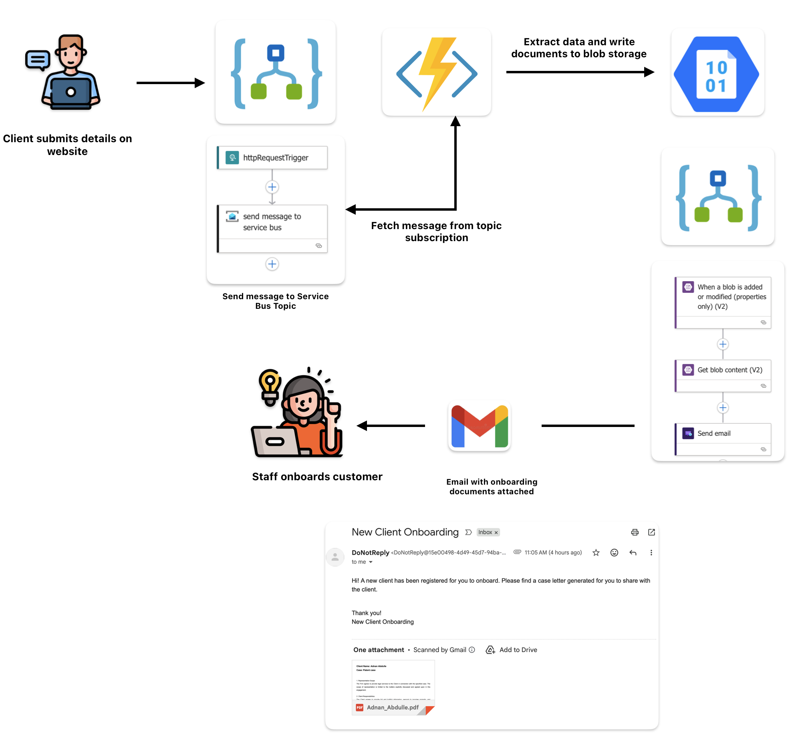

Here, I will describe an event-driven architecture built using Azure integration services 
to automate new client onboarding. This uses Azure Service Bus, Azure Functions, Azure Blob Storage, and Azure Logic Apps to create a fully automated pipeline from receiving a request to delivering a generated PDF via email.

The infrastructure code for this in this repo. For a full CI/CD deployment guide that covers multiple environments, automated build workflows, includig policy as code (PaC) for compliance checks that could be applied to this, see my much more detailed guide on 👉 [Operationalising infrastructure for enterprise-grade machine learning]( https://github.com/vulcanfox/aks-demo?tab=readme-ov-file#operationalising-infrastructure-for-enterprise-grade-machine-learning-using-kubernetes-and-terraform---) .

## Architecture and Workflow

### 1. Request Initiation (logic app using API trigger)
It all starts when an external system or user sends a request to a publicly exposed endpoint managed by a Logic App (normally we'd use Azure APIM, but not needed for now).
This Logic App acts as the entry point to the process. Upon receiving the message payload, its http trigger sends the data into a Service Bus Topic.
Using a topic instead of a queue enables flexible message distribution, allowing multiple subscribers to independently consume the same message if needed in the future.

### 2. Message Processing and PDF Generation (Azure function)
We have Azure Function that is subscribed to the Service Bus Topic through a subscription.
This means that when a new message arrives, the function can be triggered automatically. It processes the message and dynamically generates a PDF document based on the content.
The generated PDF file is then uploaded to Blob Storage, which gives us durable and cost-effective storage for documents.

### 3. Blob Monitoring and Email Notification (logic app using blob trigger)
A second Logic App monitors the target Blob storage container for new files.
When a new PDF is detected, the Logic App's blob trigger initiates a proces to fetch the blob details (such as filename, URL, and metadata) and compose an automated email notification.
The email includes the file as an attachment. This email is theen sent to a predefined recipient (for example, someone who processes new clients), completing the end-to-end workflow (email service components were configured outside terrafrom due to limitations in terraform).